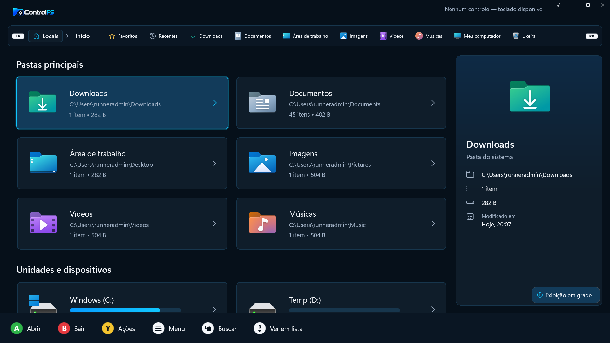
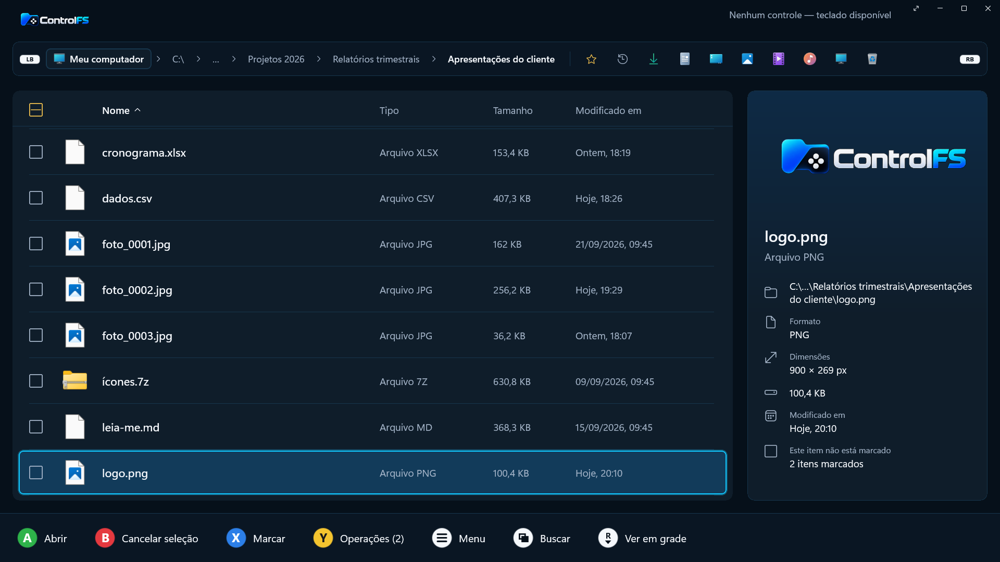
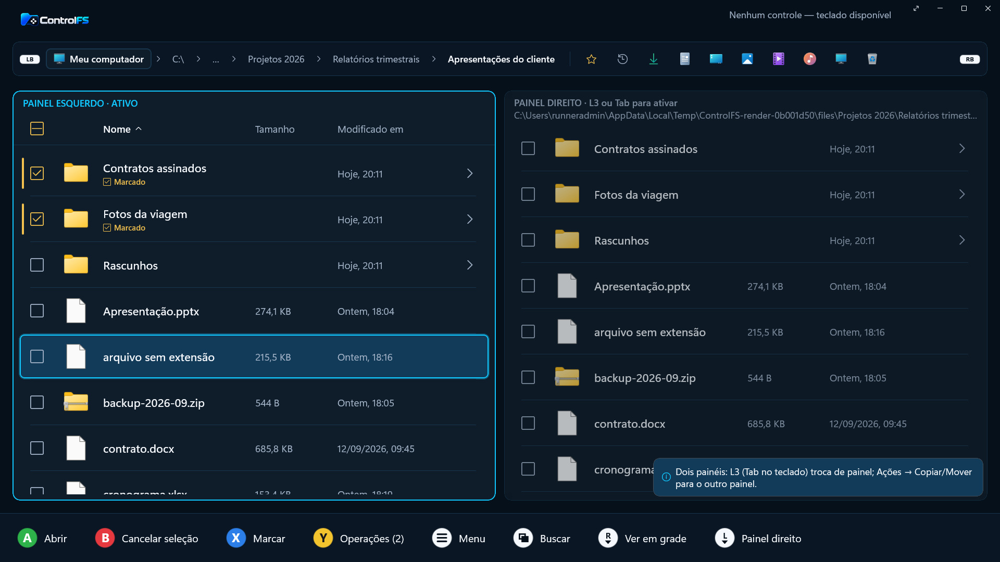
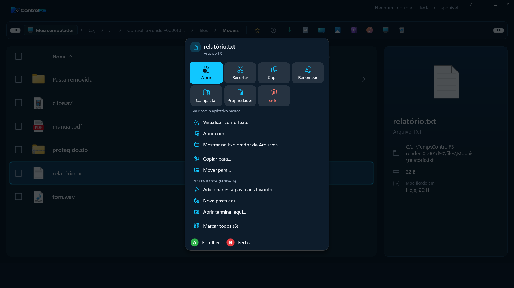
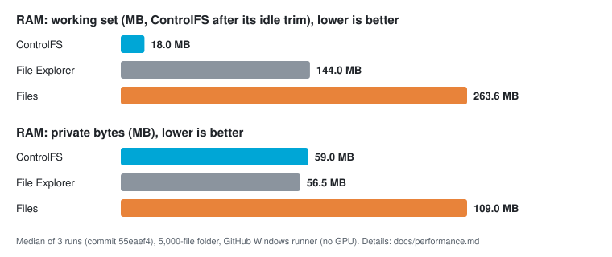

<h1 align="center"></h1>

A **native Windows file manager made for the controller**, with a **built-in extractor**: browse, organize, preview and unzip files from the couch, on a TV-connected PC or a Windows handheld. Written in C# on **.NET 10 and WinUI 3**: no Electron, no bundled browser engine, no web view. Open source (AGPL-3.0-only), local, no login, **no telemetry**.

🇧🇷 [Leia em português](README.pt-BR.md)

> **Pre-alpha.** The first vertical journey works and is covered by automated tests on real files, but the app has **not been validated on real Windows hardware or with physical controllers yet**. See [PROGRESS.md](PROGRESS.md) (Portuguese).

  

## Screenshots

The interface is in Portuguese today; these are real captures of the app (dark theme, 1920x1080, rendered by the project's CI).

| | |
|---|---|
|  |  |
|  |  |

## Download

Get **[0.16.0-alpha.1](https://github.com/nextestudios/ControlFS/releases/tag/v0.16.0-alpha.1)** (pre-release):

- **`ControlFS-Setup-x64.exe`** (recommended): per-user install, no admin, **updates itself automatically** (verified, signed updates).
- **`ControlFS-Portable-x64.exe`**: a single executable that keeps its data in the `ControlFS_Data` folder next to it; it tells you about new versions, replacing it is manual.

Windows 11 x64. Not code-signed yet, so SmartScreen may warn ([policy](docs/CODE_SIGNING.md)). On 0.1.0-alpha.1 or alpha.2? Those didn't open: run the installer once; updates are automatic from then on.

## Light on your PC

ControlFS is a native app, not a web page in a box, so it can sit next to a game. We measured it against Windows File Explorer and [Files](https://files.community) opening the **same folder of 5,000 small files** (medians of 3 runs, 10 s after opening, all processes of each app added up; Files 4.2.9.0):

| Folder of 5,000 files | ControlFS | File Explorer* | Files |
|---|---|---|---|
| RAM, working set (ControlFS after its own idle trim) | 18 MB | 144 MB | 264 MB |
| RAM, private bytes | 59 MB | 56.5 MB | 109 MB |
| CPU, idle (% of one core) | 0.31 | about 0 | 0.47 |
| Threads | 36 | 55 | 50 |

- ControlFS uses **about 45% less memory than Files** (private bytes; 59 vs 109 MB), with median CPU at idle under 1% of a core for all three.
- **Working set:** 18 MB is measured after ControlFS gives back what startup left over, once, two seconds after the first frame (Windows does the same to idle processes; the pages come back on demand). File Explorer and Files are not trimmed by us, so compare the **private bytes** row, which the trim barely changes: ControlFS is still about 2.5 MB (roughly 4%) above a File Explorer window there.
- It is **not** the lightest in every column: File Explorer's window uses about 2.5 MB less private memory and sits at about 0% CPU where ControlFS idles at about 0.3%.
- Minimized (or behind a game), ControlFS trims itself further: about 12 MB of working set in the light background mode (measured for ControlFS only; the others were not measured minimized).
- \* File Explorer shows the cost of the window's own `explorer.exe` process: on the CI runner each `explorer.exe <folder>` starts its own process, and that process is what is counted. On a real desktop the window lives inside the running shell and the cost differs.

**Why does it take about a second to open?** In our start-up log (a warm start on the test machine), the time goes to three things: Windows loading the **.NET runtime and the Windows App SDK / WinUI** before a single line of ControlFS runs (about 250 to 450 ms); ControlFS **building its screen** (about 120 ms); and **reading your preferences, listing your folders and drawing the first frame** (about 300 ms). File Explorer doesn't pay this because it is already resident in Windows, and a native C++ window has no framework to start. The first launch of the portable `.exe` also unpacks itself once (about 1.5 s); the installed version doesn't. Once open it stays light: the cost is at start-up, not while you use it. We are working on showing the window sooner and filling it in as it loads.

**Read this before quoting the numbers.** They come from a GitHub Actions `windows-latest` runner (4 vCPUs, **no GPU, software rendering (WARP), no controller**), not from a real PC: rendering costs differ from real hardware, and the numbers vary from machine to machine. "Working set" counts shared pages once per process; "private bytes" is the more honest memory figure. A 5,000-file folder was also measured with a 40-file folder (same conclusions), and the "navigate into a subfolder and back" scenario was **not** measured (it can't be scripted the same way in the three apps). Tested: ControlFS built from `main` at commit `55eaef4`, Windows 10.0.26100, 2026-09-28, medians of three Smoke runs ([36491965336](https://github.com/nextestudios/ControlFS/actions/runs/36491965336), [36491968039](https://github.com/nextestudios/ControlFS/actions/runs/36491968039), [36491972002](https://github.com/nextestudios/ControlFS/actions/runs/36491972002)). The exact method, every scenario and how to reproduce it are in [docs/performance.md](docs/performance.md); the script is [build/Compare-Performance.ps1](build/Compare-Performance.ps1) (run it from the Smoke workflow, mode `full`).

## How it works

1. Open the app: the home screen lists your folders (Downloads, Documents…) and drives.
2. Browse with the D-pad or stick; **South** opens, **East** goes back, **North** shows actions.
3. On a `.zip`, **South** opens it read-only; **North → Extract** unpacks it to a dedicated folder, here, or a folder you pick inside the app.

| Controller (position) | Does | Keyboard |
|---|---|---|
| D-pad / left stick | Move | Arrows |
| South (A / ✕) | Open / confirm | Enter |
| East (B / ○) | Back / close | Esc |
| West (X / □) | Mark item | Space |
| North (Y / △) | Item actions | F2 |
| LT / RT | Page up / down | PgUp / PgDn |
| Start | App menu | F10 |
| Menu → Tela cheia | Full screen (also the button next to minimize) | F11 |

Buttons follow **physical position**, so a Nintendo layout doesn't flip confirm and back. You can switch to "confirm with the right button" in the menu.

## Features

**Browse and navigate**
- Real folders and drives, history, sorting, hidden items, marking (select all / clear), properties, **favorite folders**, **recent folders and files** on Home, a **navigable path bar**
- **Tabs** (restored on launch, reopen closed tab, duplicate) and **two panes** side by side (L3 switches; copy/move/extract to the other pane)
- **Network locations** (mapped drives and network shortcuts), drive types at a glance (local, USB, optical, network), refreshed when a USB stick is plugged in or removed
- **Search** by name in the current folder (or the main folders from Home), with or without subfolders and with filters: results stream in, can be cancelled; no indexing, links never followed

**Views**
- **List or grid** (R3 or Ctrl+G), with 2D controller navigation, and a **details panel** with the item's info and preview
- **Dark or light theme** (follows Windows by default) and **accent colors**, all contrast-checked; a **themed title bar** and **full screen** (F11)
- **Responsive layout** for 720p/800p handhelds, desktops and 1080p/4K TVs; native Windows icons for files, folders and drives
- **Screen reader support:** Narrator announces the focused item, its position and states

**File operations**
- Rename, **batch rename** (numbering, find/replace, prefix/suffix, case), copy, cut, paste, move and delete to the **Recycle Bin**, with conflict handling (skip / keep both / replace / merge folders) and per-item results
- **Undo and redo** for reversible operations, **pause and resume**, **retry** a failed operation or only its failed items, an **operations history**; leftovers of interrupted operations are cleaned up on the next launch
- **Recycle Bin** on Home: restore to the original folder or delete permanently (always confirmed)
- **Disk usage analysis** (biggest folders and files first), create folders, **open terminal here**
- **Open with Windows:** default program, "Open with...", "Show in File Explorer"; programs and scripts ask for confirmation

**Archives**
- **Browse and extract** ZIP (including ZIP64 and AES), 7z, RAR4/RAR5, TAR, TAR.GZ and GZ without unpacking first; **split volumes** (`.7z.001`, `.part1.rar`, `.z01`) open from any part; encrypted archives with password; several archives at once, each into its own folder; **integrity test**
- **Create** ZIP, TAR.GZ and 7z from marked items, and **RAR** when WinRAR is installed on your PC (ControlFS runs your own WinRAR; RAR is proprietary, so it never bundles or reimplements it) ([matrix](docs/archive-support.md))

**Previews**
- **Images** (JPG, PNG, GIF, BMP, WebP) with zoom, pan and next/previous; **text** (logs, notes, configs, code) with **light editing**; **PDF** without Edge
- **Audio player** and a **full-screen video player** (subtitles, audio track, resume where you stopped)
- **Mount and unmount** ISO, IMG, VHD and VHDX with Windows' own mounting

**Controller**
- **Prompts that match your pad** (Xbox, PlayStation, Nintendo, generic), original vector glyphs, a context-sensitive action bar; buttons follow physical position
- A **mapping wizard** for joysticks without a profile, a **controller test screen**, and a switch for the **active controller**
- **Right-stick scrolling** in lists, menus, text, zoomed images and dialogs
- **Phone as a controller** over your local network: scan a QR code, no app to install, encrypted link (AES-256-GCM), pairing with a code and an explicit "Allow" on the PC
- Own **on-screen keyboard** (Portuguese/English, accents, symbols, suggestions, hold-to-repeat, masked passwords) usable with only directions + confirm + back

**Safety and updates**
- **Safe extraction:** nothing is written outside the destination, links are blocked, name collisions are refused, size limits, temporary staging, CRC check ([security model](docs/security-model.md))
- **Automatic, verified updates** (installed version): daily check, background download; signed manifest + SHA-256; can be turned off ([how it works](docs/GUIDE.md#updates))

**First run and gaming**
- **Welcome and guided tutorial** on first launch: the real buttons of your controller and an interactive, skippable walkthrough that never touches files (Menu → Ajuda e tutorial)
- **More from the team:** a one-time screen with the team's other apps, NextBoost PRO and Console Mode; it can be opened again from Menu → Ajuda e tutorial
- **Light in the background:** minimized or behind a game, ControlFS drops to low priority and Windows efficiency mode, and gives its memory back
- **Automation:** `controlfs://start`, `controlfs://stop`, `controlfs://show` links and `--start` / `--stop` flags for game launchers (such as Console Mode), Stream Deck buttons, and scripts; single-instance management prevents duplicates and switches cleanly

## Roadmap

**Next:** validation on real controllers (#78) and code signing (#84) before 1.0 ([roadmap by MoSCoW priority](https://github.com/nextestudios/ControlFS/issues/95)) Details in [docs/roadmap.md](docs/roadmap.md).

## Code signing policy

Free code signing provided by [SignPath.io](https://about.signpath.io), certificate by [SignPath Foundation](https://signpath.org) (application in progress: until it is approved, releases are unsigned and Windows SmartScreen may warn on first run).

- **Committers and reviewers:** [@nextestudios](https://github.com/nextestudios) (maintainer; every change goes through a pull request and CI)
- **Approvers:** [@nextestudios](https://github.com/nextestudios) (each release is approved manually before signing)
- **Build:** releases are built only by the public [release workflow](.github/workflows/release.yml) on GitHub Actions from a tag on `main`; the certificate never leaves the signing service.
- **Privacy:** this program will not transfer any information to other networked systems unless specifically requested by the user or the person installing or operating it. The only internet access is the optional update check against GitHub; connecting a phone as a controller (Menu → Conectar celular) uses only your local network, and only while you use it ([privacy policy](docs/PRIVACY.md)).

Details: [docs/CODE_SIGNING.md](docs/CODE_SIGNING.md).

## More

- [Guide](docs/GUIDE.md): controls, extraction, privacy, troubleshooting, building from source
- **Feedback:** [this form](https://github.com/nextestudios/ControlFS/issues/new?template=feedback.yml)
- Changelog: [English](CHANGELOG.en-US.md) · [português](CHANGELOG.md)

[GNU Affero General Public License v3.0 only](LICENSE) ([licensing notes](docs/LICENSING.md)) · [Third-party notices](THIRD_PARTY_NOTICES.md) · [Code signing policy](docs/CODE_SIGNING.md) · [Security](SECURITY.md)
