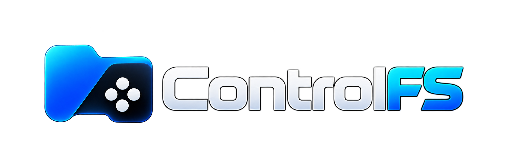

<h1 align="center"></h1>

A **file manager for Windows made for the controller**, with a **built-in extractor**: browse, organize and unzip files from the couch, on a TV-connected PC or a Windows handheld. Open source (AGPL-3.0-only), local, no login, no telemetry.

🇧🇷 [Leia em português](README.pt-BR.md)

> **Pre-alpha.** The first vertical journey works and is covered by automated tests on real files, but the app has **not been validated on real Windows hardware or with physical controllers yet**. See [PROGRESS.md](PROGRESS.md) (Portuguese).

## Download

Get **[0.4.0-alpha.1](https://github.com/nextestudios/ControlFS/releases/tag/v0.4.0-alpha.1)** (pre-release):

- **`ControlFS-Setup-x64.exe`** (recommended): per-user install, no admin, **updates itself automatically** (verified, signed updates).
- **`ControlFS-Portable-x64.exe`**: a single executable that keeps its data in the `ControlFS_Data` folder next to it; it tells you about new versions, replacing it is manual.

Windows 11 x64. Not code-signed yet, so SmartScreen may warn ([policy](docs/CODE_SIGNING.md)). On 0.1.0-alpha.1 or alpha.2? Those didn't open: run the installer once; updates are automatic from then on.

## How it works

1. Open the app: the home screen lists your folders (Downloads, Documents…) and drives.
2. Browse with the D-pad or stick; **South** opens, **East** goes back, **North** shows actions.
3. On a `.zip`, **South** opens it read-only; **North → Extract** unpacks it to a dedicated folder, here, or a folder you pick inside the app.

| Controller (position) | Does | Keyboard |
|---|---|---|
| D-pad / left stick | Move | Arrows |
| South (A / ✕) | Open / confirm | Enter |
| East (B / ○) | Back / close | Esc |
| West (X / □) | Mark item | Space |
| North (Y / △) | Item actions | F2 |
| LT / RT | Page up / down | PgUp / PgDn |
| Start | App menu | F10 |
| — | Full screen | F11 |

Buttons follow **physical position**, so a Nintendo layout doesn't flip confirm and back. You can switch to "confirm with the right button" in the menu.

## Features

- Real folders and drives, history, sorting, hidden items, marking (select all / clear), properties, **favorite folders** and **recent folders/files** on Home and a **navigable path bar**
- **Controller prompts** that match the pad in your hands (Xbox, PlayStation, Nintendo, generic), original vector glyphs, a context-sensitive action bar, and a **mapping wizard** for joysticks without a profile
- **Responsive layout** for 720p/800p handhelds, desktops and 1080p/4K TVs
- **Retry** a failed operation or only its failed items; leftovers of interrupted operations are cleaned up on the next launch
- **Native Windows icons** for files, folders, special folders and drives, loaded in the background and sized for the screen's scale
- **List or grid view** (Menu → View or Ctrl+G), with 2D controller navigation between tiles
- **Drive types** at a glance (local, USB, optical, network), refreshed when a USB stick is plugged in or removed
- **File operations:** rename, copy, cut, paste, move and delete to the Recycle Bin, with conflict handling (skip / keep both / replace / merge folders) and per-item results
- Own **on-screen keyboard** (Portuguese/English, accents, symbols, visible caret, hold-to-repeat, masked passwords) usable with only directions + confirm + back
- **Search by name** in the current folder, with or without subfolders: results stream in, can be cancelled, open in their folder; no indexing, links never followed
- **Create folder** with Windows naming rules
- **Archives:** browse ZIP, 7z, RAR, TAR, TAR.GZ and GZ without extracting; extract all or a selection; passwords; conflicts (skip / keep both / replace with confirmation); progress and per-item results
- **Compress** to ZIP or TAR.GZ from marked items, name typed on the on-screen keyboard
- **Open with Windows:** default program, "Open with…", "Show in File Explorer"; programs and scripts ask for confirmation
- **Automatic, verified updates** (installed version): daily check, background download, "Install and restart" or install on quit; signed manifest + SHA-256; can be turned off ([how it works](docs/GUIDE.md#updates))
- **Safe extraction:** nothing is written outside the destination, links are blocked, name collisions are refused, size limits, temporary staging, CRC check ([security model](docs/security-model.md))

**Extract:** ZIP, 7z, RAR4/RAR5, TAR, TAR.GZ, GZ. **Create:** ZIP, TAR.GZ. RAR can't be created (proprietary); 7z creation, split volumes, ZIP AES and ZIP64 still need validation ([matrix](docs/archive-support.md)).

## Roadmap

**Next:** validation on real controllers (#78), then the *Should* items: recent folders, tabs, history and undo, Grid View, previews, ZIP64/AES ([roadmap by MoSCoW priority](https://github.com/nextestudios/ControlFS/issues/95)) · **Later:** two panes, split volumes, light theme. Details in [docs/roadmap.md](docs/roadmap.md).

## More

- [Guide](docs/GUIDE.md): controls, extraction, privacy, troubleshooting, building from source
- **Feedback:** [this form](https://github.com/nextestudios/ControlFS/issues/new?template=feedback.yml)
- Changelog: [English](CHANGELOG.en-US.md) · [português](CHANGELOG.md)

[GNU Affero General Public License v3.0 only](LICENSE) ([licensing notes](docs/LICENSING.md)) · [Third-party notices](THIRD_PARTY_NOTICES.md) · [Code signing policy](docs/CODE_SIGNING.md) · [Security](SECURITY.md)
